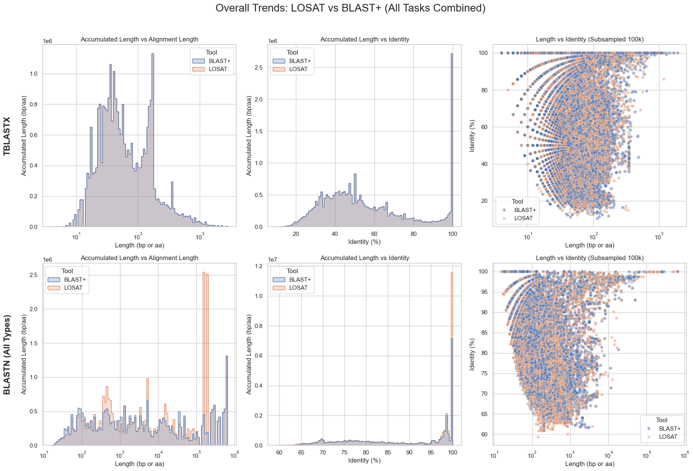
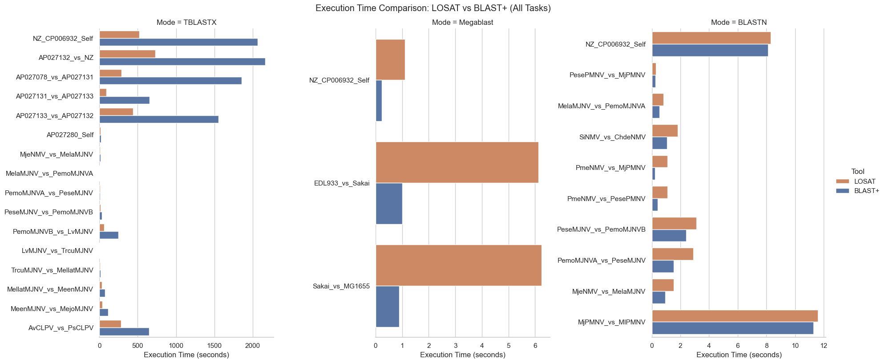

# LOSAT 🚀

> 🚧 **Work in Progress:** This project is currently in the **Alpha** stage. Features, APIs, and performance characteristics are subject to change.

**LOSAT** (LOcal Sequence Alignment Tool) aims to deliver a lightweight, high-performance reimplementation of the NCBI BLAST algorithm, written in **Rust** and optimized for **WebAssembly (Wasm)** environments.

While originally designed to power web-based bioinformatics tools, LOSAT functions as both a standalone command-line interface (CLI) and an embeddable library. It aims to democratize sequence alignment by enabling it to run anywhere without external dependencies.

## Key Features

### 🔒 Privacy & Security (Local-First)
- **Client-Side Processing:** All computations happen locally on the user's machine.
- **Data Sovereignty:** Sensitive genomic data never needs to be uploaded to third-party servers, ensuring compliance with strict data privacy regulations.

### ⚡ Zero-Friction Infrastructure
- **Serverless Architecture:** Removes the need to maintain expensive backend infrastructure for alignment tasks.
- **Portability:** Compiled to **WebAssembly**, LOSAT runs natively in any modern web browser, regardless of the underlying operating system.

### 🚀 Seamless Integration
- **Low Latency:** Eliminates the network overhead (uploading/downloading large FASTA files) associated with traditional server-side BLAST.
- **Embeddable:** Designed to be easily integrated into Rust applications or JavaScript/TypeScript web frameworks.

---

## Supported Modes
Currently, LOSAT focuses on nucleotide-nucleotide comparisons:
- **BLASTN:** Standard nucleotide vs. nucleotide alignment.
- **TBLASTX:** Translated nucleotide vs. translated nucleotide alignment (useful for finding distant relationships in coding regions).

*Protein alignment modes (BLASTP, BLASTX) are planned for future updates.*

---

## Motivation & Background

### The "Export-Process-Import" Loop
Integrating sequence alignment into web applications has traditionally been a challenge. The industry-standard NCBI BLAST+ is a command-line tool dependent on the host OS, making it impossible to run directly within a browser sandbox.

This limitation forced developers of tools like **[gbdraw](https://github.com/satoshikawato/gbdraw/)** (a genome visualization platform) to impose a fragmented workflow on their users:
1.  **Export** sequences from the web app.
2.  **Process** them externally using CLI tools or third-party web services (e.g., NCBI Web BLAST).
3.  **Import** the results back into the application.

### The Solution: Embedded Alignment
LOSAT breaks this cycle. By porting the core alignment logic to Rust, we can compile the algorithm to WebAssembly. This allows `gbdraw` and similar tools to perform alignments internally and instantly. Users perceive the analysis as a native feature of the application, dramatically improving the user experience.

---

## Technical Architecture
LOSAT is not a wrapper around existing C++ code but a native Rust implementation.
- **Memory Safety:** Leverages Rust's ownership model to ensure memory safety without a garbage collector.
- **Wasm-Bindgen:** Uses `wasm-bindgen` to facilitate high-speed communication between JavaScript and Rust modules.

---

## Performance
### Hit Distribution (Sensitivity)

### Execution Time

---

## Limitations
LOSAT is optimized for "local" alignments (e.g., comparing two viral genomes or gene clusters) rather than querying massive databases like GenBank/nt.
- **Database Size:** Best suited for small-to-medium datasets loaded in memory.
- **Features:** Advanced BLAST+ parameters (like masking algorithms or specific output formats) may not yet be fully implemented.

---

## References
- [NCBI BLAST](https://blast.ncbi.nlm.nih.gov/Blast.cgi)
- [LOSAT (MGM-166)](https://en.wikipedia.org/wiki/MGM-166_LOSAT)

## License
[MIT License](LICENSE)

[Devin Referral](https://app.devin.ai/invite/KvUrhw4lViPOEAl6)
