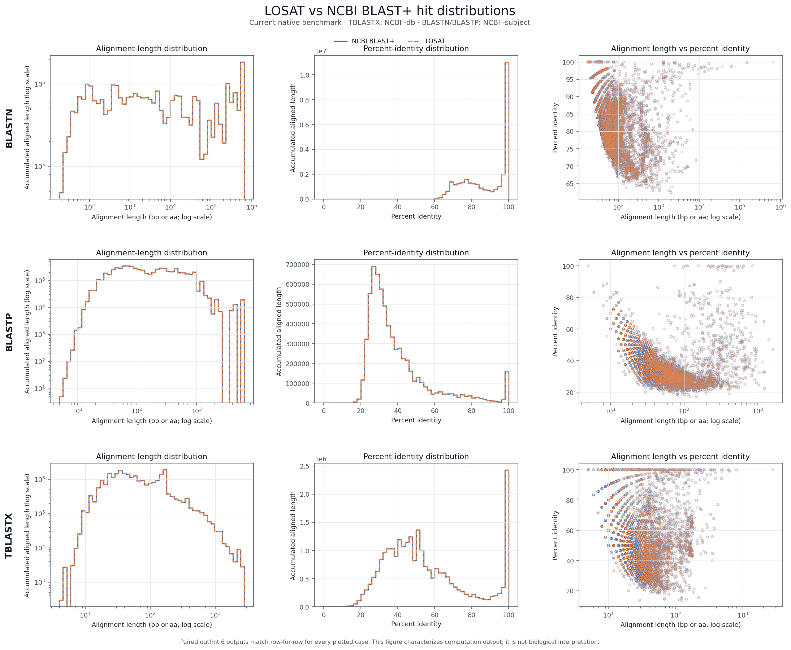
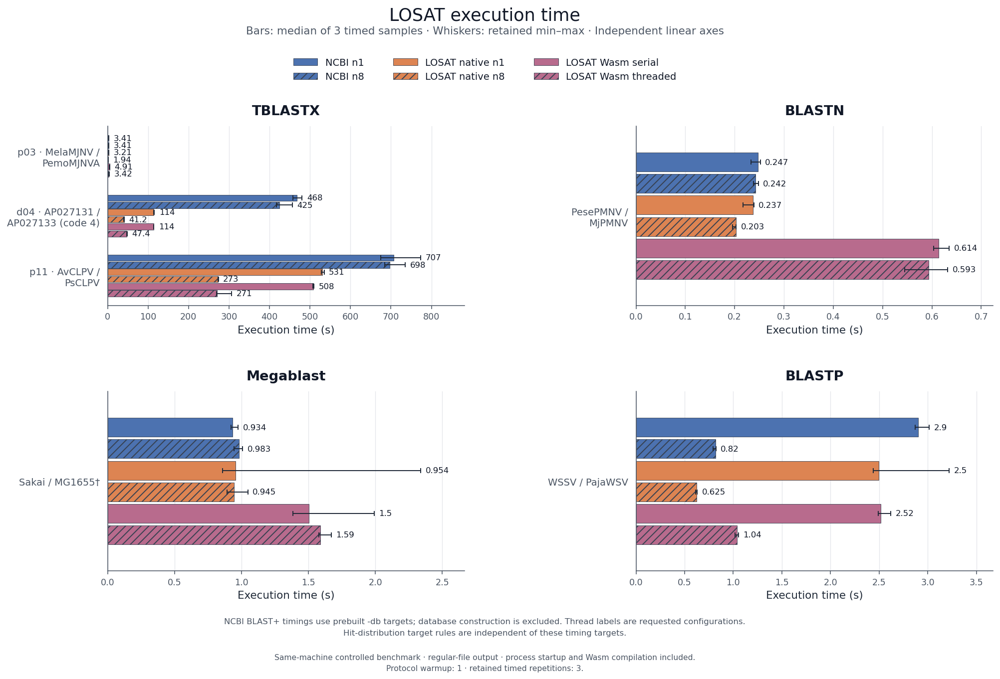

# LOSAT

LOSAT (LOcal Sequence Alignment Tool) is a Rust implementation of NCBI BLAST
local-sequence-alignment behavior for the certified profiles described below.
The project is built for native CLI use and WebAssembly-oriented embedding,
without delegating runtime behavior to NCBI BLAST+ executables or libraries.

NCBI BLAST C/C++ source code is the behavioral authority for LOSAT. NCBI BLAST+
may be used as a validation oracle in tests and release checks, but it is not a
runtime dependency, build dependency, feature fallback, or implementation
component.

## v0.1.0 Scope

The v0.1.0 release candidate is certification-gated. Program-profile
certification is complete for the scopes below, but the release itself remains
unpublished. Exact-SHA artifact certification is emitted by the manual release
workflow and is not copied back into source documentation.

| Area | v0.1.0 status | Notes |
| --- | --- | --- |
| BLASTN `--task blastn` and `--task megablast` | Supported for the certified local profile | The [14-case certification](docs/release/blastn_v0.1.0_certification.md) covers 13 exact source-defined cases and one Version 1.2 source-underdetermined equal-HSP case. |
| BLASTP / LOSATP | Supported for the certified gbdraw local profiles | The [nine-case certification](docs/release/blastp_v0.1.0_certification.md) covers gbdraw P1-P3 local query/subject workflows with standard outfmt 6. |
| TBLASTX / TLOSATX | Supported for the certified gbdraw local profiles | The [20-case certification](docs/release/tblastx_v0.1.0_certification.md) covers gbdraw P1-P2 local query/subject workflows and the approved `--db-gencode` behavior below. |
| Native CLI | Supported candidate on Linux x64, Windows x64, macOS arm64, and macOS x64 | PR 6 certified all 43 declared native contracts against the frozen Linux LOSAT output on each non-Linux target. Exact-SHA release archives are produced and certified only by the final RC workflow. |
| `wasm32-wasip1` serial command build | Supported candidate for directly applicable certified rows | PR 5 established raw-byte equality with native LOSAT for all 41 directly applicable rows: BLASTN 14, BLASTP 7, and TBLASTX 20. This is not generic Wasm support. |
| `wasm32-wasip1-threads` | Experimental | Requires the `wasm-threads` feature and a WASI runtime with thread support. |
| Rust library API | Internal only | No semver-stable API commitment in v0.1.0. |
| Web or embeddable Wasm API | Internal only | Public ABI and memory ownership are not yet release-stable. |

TBLASTX local `-subject` searches intentionally honor `--db-gencode` for subject
translation/search/reporting for every non-default genetic code. This is the
only approved v0.1.0 behavior difference from NCBI BLAST+ local `-subject`
semantics; all other timing, ordering, scoring, filtering, statistics, pruning,
and formatting behavior remains NCBI-parity gated.

## CLI Usage

Build the native CLI:

```bash
cd LOSAT
cargo build --release
```

Run local TBLASTX:

```bash
target/release/LOSAT tblastx \
  -q tests/fasta/LC738874.fasta \
  -s tests/fasta/LC738875.fasta \
  --outfmt 6
```

Run local BLASTN:

```bash
target/release/LOSAT blastn \
  -q tests/fasta/EDL933.fna \
  -s tests/fasta/Sakai.fna \
  --task megablast \
  --outfmt 6
```

Run local BLASTP:

```bash
target/release/LOSAT blastp \
  -q tests/fasta/AP027078.faa \
  -s tests/fasta/AP027131.faa \
  --outfmt 6
```

Supported output formats currently exposed by the CLI are:

- `0`: pairwise alignment view
- `6`: tabular output
- `7`: tabular output with comment lines

Custom field specifications are supported for formats `6` and `7` where the
selected program implements the requested fields.

## Verification

The program records above, the
[integrated native/serial-Wasm record](docs/release/pure_rust_runtime_v0.1.0_certification.md),
and the PR 6 cross-platform certificate are the support authorities. The
integrated result is 43/43 policy-accepted native contracts and 41/41 directly
applicable serial-Wasm/native byte equalities. PR 6 run `33625511701` produced
`CROSS_PLATFORM_NATIVE_CERTIFIED` for Windows x64, macOS arm64, and macOS x64.
The committed program gate entry points are:

```bash
cd LOSAT
cargo build --release --locked
python3 tests/compare_blastn_parity.py \
  --manifest tests/blastn_parity_manifest.tsv \
  --fresh-paired \
  --paired-output-dir /tmp/losat-blastn-v010-certification/paired-base \
  --losat-bin target/release/LOSAT \
  --ncbi-bin /home/kawato/tools/ncbi-blast-oracle/ncbi-blast-2.17.0+/bin/blastn
python3 tests/certify_blastn_v010.py \
  --manifest tests/blastn_parity_manifest.tsv \
  --paired-output-dir /tmp/losat-blastn-v010-certification/paired-base \
  --exceptions tests/blastn_v010_source_exceptions.tsv

cd ..
python LOSAT/tests/audit_blastp_v010.py \
  --output-dir /tmp/losat-blastp-v010-audit/final-native
python LOSAT/tests/audit_tblastx_v010.py \
  --output-dir /tmp/losat-tblastx-v010-certification/final-native
```

Older broad comparison scripts remain useful diagnostics, but they are not the
v0.1.0 support authorities.

NCBI BLAST+ is allowed only in these comparison and diagnostic workflows. LOSAT
runtime code must fail explicitly for unsupported behavior rather than invoking
NCBI tools as a fallback.

## Benchmark

### Hit Distribution



The current v0.1.0 certified alignment snapshot covers all 43 declared
contracts and compares LOSAT with NCBI BLAST+. See the
[complete methodology and provenance](benchmarks/v0.1.0/README.md).

### Execution Time



The execution-time figure uses final v0.1.0 main SHA
`1ef13ed09e9cf6e3d6c3b1a1ed9527a389c3992d`, NCBI BLAST+ 2.17.0, and six
representative one-thread cases. It shows the median of five timed repetitions
after one warmup. Results are machine-specific and are not a cross-platform
performance guarantee.

## WebAssembly

The crate can be built for command-style WASI targets. Plain `wasm32-wasip1`
builds are serial. Threaded Wasm builds require `wasm32-wasip1-threads`, the
`wasm-threads` feature, and a compatible runtime.

```bash
cd LOSAT
cargo build --release --target wasm32-wasip1 --no-default-features
cargo build --release --target wasm32-wasip1-threads --features wasm-threads
```

Browser-facing or embeddable Wasm APIs are not release-stable in v0.1.0.

## Limitations

- LOSAT is focused on local `-query`/`-subject` comparisons, not large database
  searches against external BLAST databases.
- Unsupported options must be treated as unsupported, not silently delegated to
  NCBI BLAST+.
- BLASTN support is limited to the local query/subject `megablast` and `blastn`
  profile in the committed certification manifest. `dc-megablast`, database
  search, and threaded-Wasm BLASTN certification remain outside this claim.
  The one demonstrated source-underdetermined equal-HSP tie is governed by
  [Product Decision Version 1.2](docs/product_decisions/PD-BLASTN-HSP-CANONICALIZATION.md)
  and the [durable certification record](docs/release/blastn_v0.1.0_certification.md).
- BLASTP support is limited to the certified gbdraw P1-P3 local query/subject
  profiles with standard outfmt 6. Database/remote search, alternate tasks and
  options, other output formats, and threaded Wasm remain outside this claim.
- TBLASTX support is limited to the certified gbdraw P1-P2 local query/subject
  profiles with standard outfmt 6 and one thread per job. Other search modes,
  output formats, unexercised options, and threaded Wasm remain outside this
  claim.
- Serial Wasm evidence covers the 41 directly applicable rows in the declared
  program manifests; it does not promote unlisted options, threaded Wasm, or a
  browser/embeddable ABI.
- Existing comparison outputs under `LOSAT/tests/*_out` are release hygiene
  targets; regenerated output should be treated as artifact or scratch data
  unless explicitly documented as canonical fixture data.

## Release Documents

- Scope: [docs/v0.1.0_scope.md](docs/v0.1.0_scope.md)
- Readiness plan: [docs/v0.1.0_release_readiness_plan.md](docs/v0.1.0_release_readiness_plan.md)
- Release note draft: [docs/release/v0.1.0.md](docs/release/v0.1.0.md)
- Exact-SHA RC contract: [docs/release/v0.1.0_rc_contract.json](docs/release/v0.1.0_rc_contract.json)
- Release procedure: [RELEASE.md](RELEASE.md)
- Changelog: [CHANGELOG.md](CHANGELOG.md)
- Contributing: [CONTRIBUTING.md](CONTRIBUTING.md)
- Security policy: [SECURITY.md](SECURITY.md)

## References

- [NCBI BLAST](https://blast.ncbi.nlm.nih.gov/Blast.cgi)
- [NCBI BLAST source](https://github.com/ncbi/ncbi-cxx-toolkit-public)

## License

[MIT License](LICENSE)
